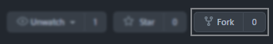

# Contributing to GFX Encyclopedia

Hello and thanks for taking your time to contribute!

The following is a set of guidelines for contributing to GFX Encyclopedia. These are mostly guidelines, not rules. Use your best judgment, and feel free to propose changes to this document in a pull request.

## Notice

This contribution guideline taken from modified [Ryuuganime Contribution Guidelines](https://github.com/ryuuganime/contributing) under [Creative Commmons Zero v1.0 International](https://github.com/ryuuganime/contributing/blob/main/LICENSE).

## Code of conduct

This project and everyone participating in it is governed by the [Contributor Covenant Code of Conduct version 2.0](CODE_OF_CONDUCT.md). By participating, you are expected to uphold this code. Please report unacceptable behavior to contact@thenewbieclub.net.

## Commit and pull request

### Forking repository

Forking a repository is a simple two-step process. Please follow this instruction below.

1. Navigate back to the repository root ([`nattadasu/tncGfx-Encyclopedia`](https://github.com/nattadasu/tncGfx-Encyclopedia)). You can pass this step if on Desktop.
2. In the top-right corner of the page, click Fork.<br/>
   

### Cloning repository

To clone this repository you need [Git](https://git-scm.com/downloads) installed on your end and the repository need to be forked (see: [Forking repository](#forking-repository)) to your GitHub account. From your command line:

```sh
git clone https://github.com/<YOUR USERNAME>/tncGfx-Encyclopedia
```

**Note**<br>
Remember to change `<YOUR USERNAME>` into your GitHub username.

### Commit changes

There is no strict guidelines for adding commit message. However, the best one is make it "uniform."

We commonly use those for prefix:

* **`Add`**<br>
  when file is untracked by git.
* **`Modify`** or **`Fix`**<br>
  when there some lines modified from previous. Use `fix` if it resolve bug on project.
* **`Update`**<br>
  when some information updated.

### Pulling a merge request

<ol>
  <li>Make sure you have required to naming your commit based on <a href="#Commit_changes">Commit changes</a> guideline.</li>
  <li>Name your pull request as<br />
    <pre><code>Detail: Comment</code></pre>
    <strong>Note</strong>:
    <dl>
      <dt>Detail</dt>
      <dd>Defining what the purpose of this pull request.<br />
      Available arguments, at the moment:
        <dl>
          <dd><code>Add</code>, <code>Modify</code>, <code>Fix</code></dd>
        </dl>
      </dd>
    </dl>
  </li>
  <li>On comment section, fill any information that were required.</li>
  <li>Click on the green "Send pull request" button to finish creating the pull request.</li>
  <li>You should now see an open pull request.</li>
</ol>

## Issuing Suggestion or Problem

Got a great idea or found an issue but can not executing as well, or unfamiliar with Git interface? Now, you can relax more because GitHub has a great feature, called [GitHub Issue](https://github.com/nattadasu/tncGfx-Encyclopedia/issues). It helps users to "interact" developers with 0 knowledge of coding.

You can send us an issue for we can look for it.

### Issuing Suggestion

<ol>
  <li>Open <a href="https://github.com/nattadasu/tncGfx-Encyclopedia/issues">nattadasu/tncGfx-Encyclopedia/issues</a> and tap on New Issue button.</li>
  <li>In title bar, write:
    <pre><code>Suggestion: &lt;your comment&gt;</code></pre>
  </li>
  <li>Adding additional comment/information would helps us figuring out what you want to suggest with.</li>
  <li>If you finished writing issue, tap Submit new issue.</li>
  <li>You should now see an open issue.</li>
</ol>

### Issuing Problem

<ol>
  <li>Open <a href="https://github.com/nattadasu/tncGfx-Encyclopedia/issues">nattadasu/tncGfx-Encyclopedia/issues</a> and tap on New Issue button.</li>
  <li>In title bar, write:
    <pre><code>&lt;your comment&gt;</code></pre>
  </li>
  <li>Adding additional comment/information would helps us figuring out what problem(s) is/are occurred.</li>
  <li>If you finished writing issue, tap Submit new issue.</li>
  <li>You should now see an open issue.</li>
</ol>
