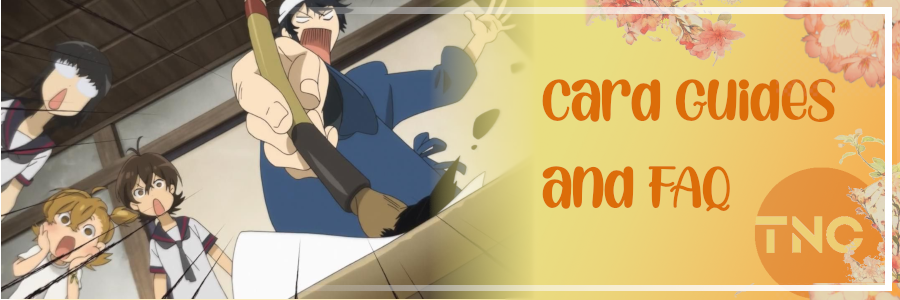
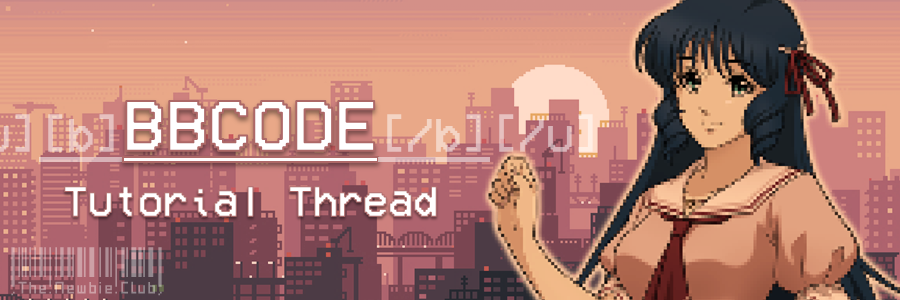
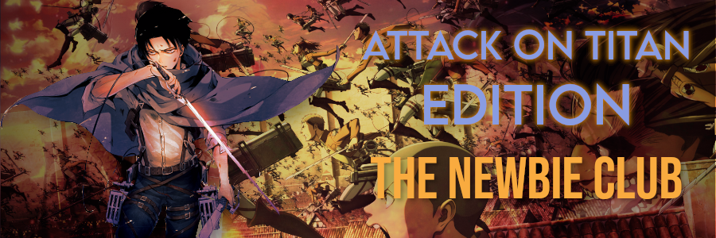
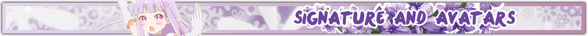
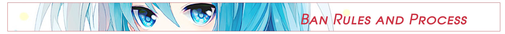
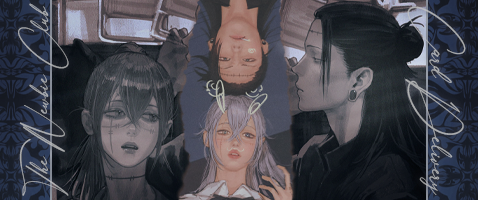
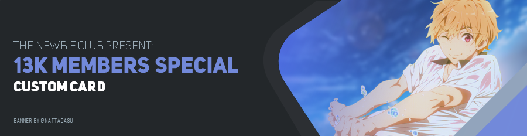
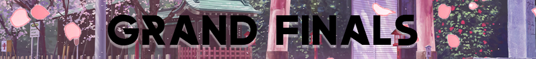
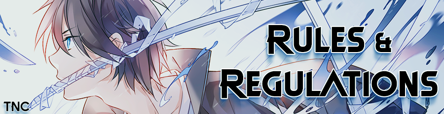

# Banners

## About banner

Banner is a visual layout, usually placed as a heading of forum thread or post. Purpose of it is
basically as "*beautification*" for the thread it self, apart it can enhance readability and easier
to distinct each thread/post. In The Newbie Club, banner has 4 categories: [Thread](#thread-banner),
[heading](#heading-banner), [delivery post](#delivery-post-banner), and
[Discord compatible](#discord-banner) banner.

## Thread banner

### Requirement for creating thread banner

* Allowed file format for artwork: PNG, A-PNG (Animated PNG), GIF, and JPEG. However,
  PNG is recommended.
* Banner width should be 900[px], recommended to use 900x300[px] (`3:1`). Artwork rotation should be
  [landscape].
* Recommended to use 300[dpi], minimum 90[dpi].
* Banner should contains 2 (two) text fields/spaces:
  1. **Thread title**, e.g: "Card Guides and FAQ", or "Shounen Edition."
  2. **Club Name**, e.g: "The Newbie Club."
     * You are allowed to use abbreviation of it, "TNC."
* Texts required to be readable, not abstract, or using darker color if overall background use dark
  color (or lighter text on light color).

### Example of thread banners

> [!WARNING]
> This section can take a lot of data.

#### General Threads

 *Lumzing*

 *Natsu*

#### Edition Releases

 *Komatarusa*

 *Natsu*

## Heading banner

### About heading

The headline or heading is the text indicating the nature of the article below it.

<!--It is sometimes termed a news hed, a deliberate misspelling that dates from production flow
during hot type days, to notify the composing room that a written note from an editor concerned
a headline and should not be set in type.-->

Headlines in English often use a set of grammatical rules known as *headlinese*, designed to meet
stringent space requirements by, for example, leaving out forms of the verb "to be" and choosing
short verbs like "eye" over longer synonyms like "consider."[1](#fn1)

### Requirement for creating heading banner

* Allowed file format for artwork: PNG, A-PNG (Animated PNG), GIF, and JPEG. However, PNG is
  recommended.
* Banner width should be 900[px] and height of banner should be one third or half of
  [thread banner height](#requirement-for-creating-thread-banner), recommended to use 900x150[px]
  (`6:1`) or below. Artwork rotation should be [landscape].
* Recommended to use 300[dpi], minimum 90[dpi].
* Banner should contains only a text field/space:
  1. **Heading title**, e.g: "What is BBCode?."
* Texts required to be readable, not abstract, or using darker color if overall background use dark
  color (or lighter text on light color).
* Text proportion should be wider than image content.

### Example of heading banners

 *Natsu*

 *TheMilkMan*

 *Vina*

## Delivery post banner

### Requirement for creating delivery post banner

* Allowed file format for artwork: PNG, A-PNG (Animated PNG), GIF, and JPEG. However, PNG is
  recommended.
* Banner width should be 478[px] and height of banner should less than or equal to 200[px],
  recommended to use 478x200[px] (`239:100`) or below. Artwork rotation should be [landscape].
* Recommended to use 300[dpi], minimum 90[dpi].
* Banner should contains only 2 (two) text fields/spaces:
  1. **Club Name**, e.g: "The Newbie Club."
  2. **Card Delivery**.

### Example of delivery post banners

 *Natsu*

 *Jules*

## Discord banner

### Requirement for creating Discord banner

* Allowed file format for artwork: PNG, GIF, and JPEG. However, PNG is recommended.
* Banner width should be 900[px], height should be less than or equal to 232[px]. Recommended to use
  900x232[px] (`3:1`). Artwork rotation should be [landscape].
* File size is should be less than 5MB.
* Recommended to use 300[dpi], minimum 90[dpi].
* Banner should contains 2 (two) text fields/spaces:
  1. **Channel/Topic/Event/Thread title**, e.g: "Rules", or "Battle Royale."
  2. **Club Name**, e.g: "The Newbie Club."
     * You are allowed to use abbreviation of it, "TNC."
* Texts required to be readable, not abstract, or using darker color if overall background use dark
  color (or lighter text on light color).
* Text proportion should be wider than image content.

#### Additional note

1. If the channel/topic/event/thread required additional banner for heading, below the modified
   rules of it:
   * Banner should contains only a text field/space:
     1. **Heading title**, e.g: "Moderators."
        * Additional text field is allowed as long it related to the subject.
   * Height of artwork can be one third or half of recommended size.
2. A-PNG (Animated PNG) can not be used on vanilla/pure/unmodified Discord client due to its
   limitation. Prefer to use GIF instead.

### Example of Discord banners

#### Headers

 *Natsu*

 *Natsu*

#### Headings

 *Natsu*

 *Naegi*

 *Natsu*

 *Naegi*

## Footnotes

  

    <a id="fn1">1</a>:
    <a href="https://en.wikipedia.org/wiki/Headline">Headline - Wikipedia (English)
      <i class="fas fa-external-link-square-alt"></i>
    </a>
  

<!--HYPERLINKS-->
[dpi]: /glosarium.md#dots-per-inch-dpi
[landscape]: /glosarium.md#landscape
[portrait]: /glosarium.md#portrait
[px]: /glosarium.md#pixel
[ratio]: /glosarium.md#aspect-ratio